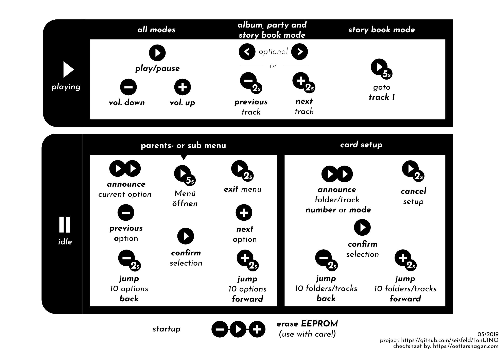

Alternative TonUINO Firmware
============================

This is my alternative firmware for the wonderful [TonUINO](https://www.voss.earth/tonuino/) project. The goal of this firmware is not to implement 100% the same features as the original firmware. I more or less just added what fits my use case and i also removed (for now?) some stuff i currently don't really need. Overall it's just fun to play around with TonUINO, which is also the reason why i am very active in the [TonUINO Community](https://discourse.voss.earth/). Make sure you drop by, there is lots of stuff to discover.

**The firmware is provided "as-is". I'm happy if all this is useful for anyone else, but can't offer support.**

## Features

- Playback modes: Story, album, party, single, story book.
- Saves playback modes etc. directly to the NFC tags/cards.
- Next/previous track in album, party and story mode.
- Supports MIFARE Classic (Mini, 1K & 4K) tags/cards.
- Supports MIFARE Ultralight / Ultralight C tags/cards.
- Supports NTAG213/215/216 tags/cards.
- Debug output to the serial console.
- Setup dialogues (setup/erase NFC tags/cards, parents menu etc.) can be aborted.
- NFC tags/cards can be erased.
- Parents menu to erase NFC tags/cards and to change settings like startup volume, maximum volume, menu volume, equalizer and shutdown timer (requires an external circuit). You can manually trigger the shutdown there as well.
- Settings are stored in EEPROM.
- Optional: 5 Buttons.
- Optional: IR remote control (incl. box lock). The remote (which needs at least 7 keys) can be learned in using the parents menu.
- Optional: Status LED.
- Optional: Low voltage shutdown i.e. for the [CubieKid PCB](https://www.thingiverse.com/thing:3148200).
- Optional: FM radio module (TEA5767) support

## Button Cheat Sheet

## SD Card Folder Structure

The folders on the SD card, that will hold your media files, need to be named **01 bis 99** - that is **two digits**. The media files in these folders need to start with a **three digit zero padded number** like **001 to 255**, but may [1] contain more characters afterwards. Allowed would be `001.mp3` or `001MyTune.mp3`.

It has been proven benefitial to prepare the whole folder structure on the computer and then copy everything to the SD card in one go. That way it's made sure the order of the files is correct.

[1] Not all derivates of the DFPlayer Mini module accept characters after the three digit number. In this case only `001.mp3`, `002.mp3` etc. would be allowed.

## Audio Messages

TonUINO only functions correctly, when there is the correct (**as in matches the firmware**) set of audio messages on the SD card. These are stored in the folders **mp3** and **advert**.

You can create the matching set of audio messages, using the `create_audio_messages.py` python script supplied in this repo. The script can create *english* and *german* audio messages. The description down below describes *english*.

The script offers two options to do this:

  1. Using the tools `say` (requires macOS) and `ffmpeg`. If you have a Mac this way is pretty simple.
  2. Using the Google text-to-speech service. For this option you need an API key (which is free for the amount of messages you need), but the result sounds better than option one.

The audio message files are not available for download at this point in time.

### How to create audio messages using `say` (option one)

Besides the tool `say` (part of macOS) you also need `ffmpeg`. The later can quickly be installed via Homebrew.

To install Homebrew, open `Terminal.app` and follow the instructions on the [Homebrew](https://brew.sh) website. After that, please follow these steps in Terminal:

#### Install ffmpeg

1. `brew update`
2. `brew install ffmpeg`

When that completed successfully, you can create the audio messages. In Terminal:

#### Create Audio Messages

1. Change into the folder where you unzipped the `.zip` from GitHub or where you cloned the repo to.
2. Run `python create_audio_messages.py en`.
3. Copy the contents of the folder **sd-card** to the SD Card.

### How to create audio messages using Googles text-to-speech service (option two)

1. Go to [Googles text-to-speech website](https://cloud.google.com/text-to-speech/) and create an account and an API key.
2. Change into the folder where you unzipped the `.zip` from GitHub or where you cloned the repo to.
3. Open the file `create_audio_messages.py` and enter your API key at the line with `googleApiKey=`. Then remove the comment character `#` at the begining of the line.
4. Run `python create_audio_messages.py en`.
5. Copy the contents of the folder **sd-card** to the SD Card.

## License

GPL v3. See [LICENSE](../LICENSE.md).
